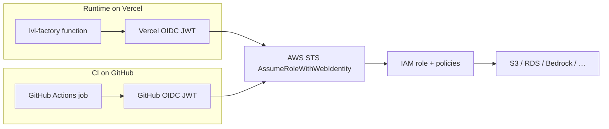

# LVL Ltd — domain, commerce, edge (live model)

> Source of truth for **lvlltd.com** factory commerce: store, agents, Printify, multi-rail pay, Cloudflare DDoS/WAF, image proxy.

## Hosts

| Host | Role | App home |
|------|------|----------|
| **https://lvlltd.com** | Brand apex + marketplace hub | `/marketplace` |
| **https://www.lvlltd.com** | WWW → hub | `/marketplace` |
| **https://factory.lvlltd.com** | Full stack (store + operator + APIs) | `/` |
| **https://shop.lvlltd.com** | Buyer storefront | `/shop` |
| **https://pay.lvlltd.com** | Multi-rail settlement | `/pay` |
| **https://checkout.lvlltd.com** | Unified cart → POD / rails | `/checkout` |
| **https://account.lvlltd.com** | Buyer account | `/account` |
| **https://orders.lvlltd.com** | Order history | `/orders` |
| **https://seller.lvlltd.com** | Seller portal (pipeline / hooks) | `/seller` |
| **https://admin.lvlltd.com** | Operator console | `/` |
| **https://agents.lvlltd.com** | Agent protocol UI | `/agent/merch` |
| **https://music.lvlltd.com** | Music packs | `/music` |
| **https://api.lvlltd.com** | Catalog API | `/api/store/catalog` |
| **https://factory.lvlltd.com/shop** | Store path (same app) | `/shop` |
| **https://factory.lvlltd.com/network** | Domain matrix UI | `/network` |
| **https://lvlxltd.printify.me** | Printify Pop-Up (physical POD) | external |
| https://lvl-factory.vercel.app | Vercel origin (do not publish) | gated |
| Worker | `cloudflare/workers/lvl-factory-proxy` | edge |

In-app model: `src/lib/marketplace/hosts.ts` + `LVL_NETWORK` / `CLOUDFLARE_MAP` in `src/lib/merch/printify.ts`.  
Host rewrite: `HostRewrite` maps dedicated subdomain `/` → surface home.

#
### Edge Suite hosts (new)

| Host | Role | App home |
|------|------|----------|
| **https://drops.lvlltd.com** | Live flash drops | `/drops` |
| **https://pulse.lvlltd.com** | Network activity stream | `/pulse` |
| **https://studio.lvlltd.com** | Imagine design studio | `/studio` |
| **https://relay.lvlltd.com** | A2A agent commerce relay | `/relay` |
| **https://bundles.lvlltd.com** | Multi-SKU stack packs | `/bundles` |
| **https://radar.lvlltd.com** | Restock watches | `/radar` |

Edge paths also live on factory: `/drops` `/pulse` `/studio` `/relay` `/bundles` `/radar`.  
Loyalty + gift checkout: `/account` · `/checkout`. Fit assistant on apparel PDPs. ⌘K command palette.

## Marketplace surfaces (paths)

| Path | Purpose |
|------|---------|
| `/marketplace` | Hub (all tools + domain matrix) |
| `/shop/*` | LVL Store |
| `/checkout` | Unified checkout + order ledger |
| `/account` | Buyer account |
| `/orders` | Order history |
| `/seller` | Seller portal |
| `/pay` | Multi-rail pay |
| `/agent/merch` | Agent catalog |
| `/pipeline` · `/webhooks` | Seller/ops Printify |

---

## Architecture

```
Internet / agents / Printify
        │
        ▼
Cloudflare anycast (unmetered DDoS L3–L7)
  · Zone WAF packs: printify + shop-pay
  · Rate limiting rules
  · Worker lvl-factory-proxy (edge methods, RL, signature gate)
        │
        ▼
factory.lvlltd.com → Vercel Nitro SSR (origin WAF + HMAC + store RL)
        │
        ├─ /shop          LVL Store UI
        ├─ /pay           multi-rail settlement UI
        ├─ /api/store/*   catalog + optimized image proxy
        ├─ /api/printify/* webhooks + subscriptions
        ├─ /pipeline      Imagine → Printify drafts
        └─ /agent/merch   agent protocol UI
```

**Not used for this stack (by design):** AWS Shield Advanced, Global Accelerator, S3 Transfer Acceleration on Printify’s bucket (we don’t own it; mockups are small/cached).

---

## LVL Store

| Path | Purpose |
|------|---------|
| `/shop` | Home + latest drops |
| `/shop/collections/:handle` | tees, art, agent, boston, statement, all + search/sort |
| `/shop/:slug` | PDP (size, qty, cart, Printify + agent pay) |
| `/shop/cart` | Cart · Printify checkout · multi-rail pay |
| `/merch` | **Redirects** → `/shop` |

| Module | Path |
|--------|------|
| Cart | `src/lib/store/cart.ts` |
| Collections | `src/lib/store/collections.ts` |
| Images | `src/lib/store/images.ts` + `image-proxy.server.ts` |
| Origin store WAF | `src/lib/store/edge-waf.server.ts` |
| UI shell | `src/components/store/*` |

### Image proxy (Printify → S3)

Printify `images-api` often returns empty body + `x-automaton-object-url` (S3).

| Endpoint | Behavior |
|----------|----------|
| `GET /api/store/image?u=` | Resolve + **302** to S3 (default, cheapest) |
| `?mode=stream` | Proxy JPEG bytes (same-origin, long CDN cache) |
| `?mode=json` | `{ resolved, source, cached }` |
| `?stats=1` | Cache stats |
| `POST` `{ warm: [] }` | Warm resolve cache |

Optimizations: TTL memory cache, in-flight coalescing, HEAD-first, seed map `RESOLVED_MOCKUPS`, CDN `s-maxage`.

---

## Agent commerce

| Item | Value |
|------|--------|
| Protocol | `lvl-merch-v1` |
| UI | `/agent/merch` |
| API | `GET /api/store/catalog` |
| Pay | `/pay?sku=SKU&amount=PRICE` |
| Human store | `/shop` |
| Module | `src/lib/merch/agent-commerce.ts` |

---

## Printify webhook sync

Inbound webhooks + optional API pull keep local mirrors for marketplace ops.

| Topic family | Effect |
|--------------|--------|
| `order:*` | Upsert `printify_orders_mirror` (status, lines, totals) |
| `product:*` | Upsert `printify_products_mirror` (API enrich when payload thin) |
| `product:deleted` | Soft-delete product mirror |
| `shop:disconnected` | Alert note + sync run |

| Endpoint | Purpose |
|----------|---------|
| `POST /api/printify/webhooks` | Receive (HMAC) → `processWebhookEvent` → sync |
| `GET /api/printify/webhooks` | Events, orders, products, sync dashboard |
| `POST /api/printify/sync` `{action:full\|products\|subscriptions}` | Pull remote hooks + catalog |
| `POST /api/printify/subscriptions` `{action:sync}` | Same full pull from ops UI |
| `GET /api/store/catalog` | Live seed + extra mirrored products |

Module: `src/lib/merch/printify-sync.server.ts` · migration `0003_printify_sync.sql`

---

## Printify

| Item | Value |
|------|--------|
| Store | https://lvlxltd.printify.me (`lvlxltd`) |
| Webhook receive | `POST /api/printify/webhooks` |
| Operator UI | `/webhooks` |
| HMAC | `X-Pfy-Signature: sha256=<hex>` · `printify-hmac.server.ts` |
| Secrets | `PRINTIFY_WEBHOOK_SECRET` (+ `_PREVIOUS`), `PRINTIFY_API_TOKEN`, `PRINTIFY_SHOP_ID` |
| Pipeline UI | `/pipeline` · stages brief → imagine → mockup → draft → review → published |

```bash
npm run test:hmac
```

---

## Multi-rail payment

**Mainnets only.** Buyers choose crypto or Stripe card.

| Network | Chain ID | Assets |
|---------|----------|--------|
| Ethereum | `1` | USDC, USDT, ETH |
| Base | `8453` | USDC, USDT, ETH (default x402 rail) |
| Solana | `101` | USDC SPL, USDT SPL, SOL |
| Arbitrum / Optimism / Polygon | … | USDC, USDT, native |

| Field | Value |
|-------|--------|
| EVM treasury | `0xa00876513bAA433ce2B58A5341Fd06d2b6f9A6ED` |
| Sol treasury env | `VITE_TREASURY_SOL` |
| WC project | `VITE_WALLETCONNECT_PROJECT_ID` |
| Source | `src/lib/factory/payment.ts` |
| UI | `/pay` · canary `/canary` |

Stripe account `acct_1TVJoWE6xjYB5uvs` — card canary $0.50 min; crypto canary $0.05.

---

## Cloudflare DDoS + WAF

### Automatic
- **Unmetered DDoS** (L3–L7) on orange-clouded hostnames
- Keep `factory.lvlltd.com` **proxied**; never publish Vercel origin

### Zone packs (`cloudflare/waf/`)

| Pack | File | Surfaces |
|------|------|----------|
| printify | `printify-webhooks-rules.json` | `/api/printify/*` |
| shop-pay | `shop-pay-rules.json` | `/shop`, `/api/store/*`, `/pay`, `/agent/*` |

| Path | Highlights |
|------|------------|
| `/shop` | Methods GET/HEAD; threat challenge; **300**/min |
| `/api/store/catalog` | Agent-friendly; **120**/min |
| `/api/store/image` | GET only; **240**/min |
| `/pay` | Challenge GET; **skip Bot Fight on POST**; **30** POST/min |
| Webhooks | **60** POST/min; signature rule optional; **no** challenge on POST |

```bash
export CLOUDFLARE_API_TOKEN=...
export CLOUDFLARE_ZONE_ID=...

npm run waf:all:dry          # preview
npm run waf:all              # printify + shop-pay
npm run waf:shop             # shop-pay only
ENABLE_SIGNATURE_RULE=1 npm run waf:all
```

### Worker edge (`cloudflare/workers/lvl-factory-proxy`)

v2 enforces method allowlists + Cache-API rate limits for **printify, store, shop, pay, agent** before proxying to Vercel. Security headers + edge version `x-lvl-edge-version: 2`.

```bash
npx wrangler deploy -c cloudflare/workers/lvl-factory-proxy/wrangler.toml
# vars/secrets: ORIGIN_URL, ENFORCE_SIGNATURE, WEBHOOK_GATE_TOKEN, WEBHOOK_ADMIN_TOKEN
```

### Origin

| Layer | Module |
|-------|--------|
| Webhooks | `webhook-waf.server.ts` + HMAC |
| Store/image | `edge-waf.server.ts` on catalog + image handlers |

### Under Attack Mode
If enabled zone-wide, exclude or carefully test **webhook POST** and **pay POST** (providers cannot solve challenges). Prefer path rules over global UAM.

### AWS note
**Shield Advanced / Global Accelerator** only matter if you later put a public **AWS** edge (CloudFront/ALB/AGA). Current edge is Cloudflare — do not buy Shield for Vercel.

---

## Tier 1 operator loop

1. **Tier 1 Plan** → Seed packs  
2. Approve + publish  
3. Export bundle  
4. Canary unlock via `/pay`  
5. Stripe webhooks on apex for sealed unlock (marketplace path)

---

## Ops

```bash
# Redeploy factory DNS proxy (marketplace repo)
gh workflow run "Provision Factory DNS" -R omgawdmadeit1/lvlltd-agent-marketplace -f subdomain=factory

# This repo
npm run typecheck
npm run build
npm run waf:all
```

Env (server): `PRINTIFY_*`, `DATABASE_URL` / PGLite, payment `VITE_*` for client rails.

---

## Vercel environment variables

Dashboard: [Project env settings](https://vercel.com/tesla-trek/lvl-factory/settings/environment-variables)  
Project `prj_0m75OJchmM0HOizAy7hTqdKghyPR` · team `team_EbvXskCGZVZiHauixSNsUAKv`  
Manager: `scripts/sync-vercel-env.mjs` · `npm run vercel:env*`

### Scope policy (targets)

| Scope | Vercel targets | Use for |
|-------|----------------|---------|
| **ALL** | production, preview, development | Public client `VITE_*` |
| **DEPLOYED** | production, preview | Server secrets needed on live + PR previews |
| **PRODUCTION** | production | Strict HMAC / enforce flags |
| **DEVELOPMENT** | development | Diag / loose verify (`vercel pull`) |
| **NONE** | *(not pushed)* | Cloudflare WAF script tokens (local only) |

```bash
npm run vercel:env:scopes   # full matrix
```

### Catalog

| Key | Scope | Type | Notes |
|-----|-------|------|-------|
| `VITE_WALLETCONNECT_PROJECT_ID` | ALL | plain | `7e30c6e6441bbc7523e87195868a572a` (also `.env.production`) |
| `VITE_TREASURY_SOL` | ALL | plain | Sol treasury pubkey (also `.env.production`) |
| `VITE_STUN_URLS` | ALL | plain | Optional |
| `VITE_AUTH_ENABLED` | ALL | plain | Optional; `false` = dev user |
| `PRINTIFY_API_TOKEN` | DEPLOYED | sensitive | Live catalog / orders |
| `PRINTIFY_SHOP_ID` | DEPLOYED | sensitive | |
| `PRINTIFY_WEBHOOK_SECRET` | DEPLOYED | sensitive | HMAC primary |
| `PRINTIFY_WEBHOOK_SECRET_PREVIOUS` | DEPLOYED | sensitive | Rotation |
| `WEBHOOK_GATE_TOKEN` | DEPLOYED | sensitive | Edge gate |
| `WEBHOOK_ADMIN_TOKEN` | DEPLOYED | sensitive | Admin ops |
| `DATABASE_URL` | DEPLOYED | sensitive | Neon/Postgres; else PGLite |
| `PRINTIFY_WEBHOOK_URL` | DEPLOYED | plain | Override public URL |
| `PRINTIFY_WEBHOOK_MAX_AGE_SEC` | DEPLOYED | plain | Replay window |
| `PRINTIFY_WEBHOOK_STRICT` | PRODUCTION | plain | Hard fail bad HMAC |
| `ENFORCE_SIGNATURE` | PRODUCTION | plain | Alias strict |
| `PRINTIFY_WEBHOOK_LOOSE` | DEVELOPMENT | plain | Local only |
| `PRINTIFY_HMAC_DIAG` | DEVELOPMENT | plain | Local only |
| `CLOUDFLARE_API_TOKEN` | NONE | sensitive | `waf:*` scripts only |
| `CLOUDFLARE_ZONE_ID` | NONE | sensitive | Local only |
| `CLOUDFLARE_ZONE_NAME` | NONE | plain | Local only |

### Commands

| Command | Token? | Purpose |
|---------|--------|---------|
| `npm run vercel:env` | No | Status + scopes + local values |
| `npm run vercel:env:scopes` | No | Scope matrix only |
| `npm run vercel:env:dry` | No | Preview push with per-var targets |
| `npm run vercel:env:list` | Yes | Remote keys + **scope mismatch** warnings |
| `npm run vercel:env:diff` | Yes | create / rescope / keep |
| `npm run vercel:env:sync` | Yes | Upsert with correct `target[]` |

```bash
export VERCEL_TOKEN=vcp_…          # team tesla-trek
# optional: cp .env.example .env.vercel && fill PRINTIFY_* …
npm run vercel:env:dry
npm run vercel:env:sync            # applies scopes above
npm run vercel:env:list            # verify remote targets
# then redeploy production
```

**Rules:** never put secrets in `VITE_*`; never push Cloudflare ops tokens to Vercel; redeploy after env changes so client `VITE_*` rebuild.

## Vercel team permissions

**Team:** [tesla-trek](https://vercel.com/tesla-trek) · `team_EbvXskCGZVZiHauixSNsUAKv`  
**Members / roles UI:** [Team settings → Members](https://vercel.com/teams/tesla-trek/settings/members)  
**Project access UI:** [lvl-factory → Settings → Access](https://vercel.com/tesla-trek/lvl-factory/settings/access)  
**Docs:** [RBAC / team roles](https://vercel.com/docs/accounts/team-members-and-roles)

### Live access (verified via connected Vercel account)

| Check | Result |
|-------|--------|
| Teams visible to MCP | **tesla-trek** only |
| `lvl-factory` project | Readable + deployable (production READY) |
| Other team projects | 14 projects on this team (lvlltd-*, dropagent-*, tesla-trek, …) |
| Deployment protection | **Vercel Authentication ON** for `all_except_custom_domains` |
| Password protection | Off |
| Trusted IPs | Off |

Implication: `*.vercel.app` previews require a logged-in Vercel user on the team; **custom domains** (e.g. factory.lvlltd.com) stay public. That is the intended public-store setup.

### Team roles (what to assign)

| Role | Use for LVL Factory | Can prod-deploy | Env secrets | Team billing / members |
|------|---------------------|-----------------|-------------|------------------------|
| **Owner** | You (account owner) | Yes | Yes | Yes |
| **Member** | Full engineers / CI owner account | Yes | Yes | Limited |
| **Developer** | Day-to-day deploys + previews | Yes (if allowed) | Project env (varies) | No |
| **Viewer** | Read-only stakeholders | No | No (values hidden) | No |
| **Billing** | Invoices only | No | No | Billing only |

For **GitHub Actions** and **CLI tokens**, create the token while signed in as **Owner** or **Member** on **tesla-trek**, with scope that includes this team (not “personal hobby only”).

### Token scopes (CLI / Actions)

Create at [vercel.com/account/tokens](https://vercel.com/account/tokens):

| Capability needed | Why |
|-------------------|-----|
| Deployments | `vercel deploy`, Actions production push |
| Projects | link / read `lvl-factory` |
| Environment Variables | `npm run vercel:env:sync` |
| (Optional) Full Account | simplest for solo Owner |

Never grant a CI token to a Viewer-only user — deploys and env writes will 403.

### Project-level access (lvl-factory)

If the team uses project-scoped roles / access groups:

| Project role | Typical use |
|--------------|-------------|
| **Admin** | Full project settings, env, domains, Git link |
| **Project Developer** | Deploy + most build settings |
| **Project Viewer** | Logs / deployments read-only |

**Recommended for you (solo Owner):** keep Owner on the team; no extra project ACL needed.  
**If inviting helpers:** Developer on team **or** Project Developer only on `lvl-factory` — not Owner.

### Deployment protection (current)

| Setting | Value | Notes |
|---------|-------|-------|
| Vercel Authentication | **Enabled** · `all_except_custom_domains` | Protects `lvl-factory.vercel.app` |
| Password | Disabled | |
| Trusted IPs | Disabled | |

Public storefront traffic should hit **factory.lvlltd.com** (custom domain), not the raw `.vercel.app` origin.

### GitHub + Vercel app permissions

Separate from team RBAC — the [Vercel GitHub App](https://github.com/apps/vercel) on **omgawdmadeit1** needs access to **lvl-factory** for native Git deploys:

1. [Team members](https://vercel.com/teams/tesla-trek/settings/members) — ensure your user is **Owner**
2. [Git settings](https://vercel.com/tesla-trek/lvl-factory/settings/git) — Connect `omgawdmadeit1/lvl-factory`
3. GitHub → org/user → Applications → Vercel → repository access includes **lvl-factory**

### Checklist (Owner, once)

- [ ] You are **Owner** on [tesla-trek members](https://vercel.com/teams/tesla-trek/settings/members)
- [ ] Token for CLI/Actions created with **tesla-trek** team scope
- [ ] GitHub Actions secret `VERCEL_TOKEN` set (if using Actions fallback)
- [ ] Git integration linked (preferred) **or** Deploy Hook URL secret
- [ ] Production env vars set (see § Vercel environment variables)
- [ ] Leave Vercel Auth on for `.vercel.app`; keep public traffic on custom domain

---

## AWS IAM Roles Anywhere

**X.509 certificate federation** for workloads **outside AWS** that do not speak OIDC (or prefer PKI). Distinct from Vercel/GitHub OIDC paths already in this repo.

### What it is

[IAM Roles Anywhere](https://docs.aws.amazon.com/rolesanywhere/latest/userguide/introduction.html) lets on-prem servers, factories, edge devices, containers, or other non-AWS hosts exchange a **client certificate** for temporary AWS credentials (`CreateSession`), without long-lived access keys.

| Piece | Role |
|-------|------|
| **Trust anchor** | Your CA (AWS Private CA or external PEM CA) that Roles Anywhere trusts |
| **Profile** | Which IAM roles can be assumed + optional session policies / duration |
| **IAM role** | Trusts principal `rolesanywhere.amazonaws.com` (not an OIDC IdP) |
| **End-entity cert** | Issued by that CA to the workload; private key stays on the host |
| **Credential helper** | `aws_signing_helper` (or SDK) signs CreateSession with the cert |

Flow: workload presents cert → Roles Anywhere validates against trust anchor → STS-like temp creds for the profile’s role.

### Trust anchors (deep dive)

A **trust anchor** is the Roles Anywhere object that binds AWS to **your CA**. Every `CreateSession` cert must chain (or match issuer rules) to a CA registered as a trust anchor.

```text
[ CA: AWS Private CA or external PEM ]
            │
            ▼
   Trust Anchor (Roles Anywhere)
            │
            ▼  validates end-entity cert
   CreateSession + aws_signing_helper
            │
            ▼
   Profile → IAM role → temp credentials
```

#### Source types

| `sourceType` | Source data | When to use |
|--------------|-------------|-------------|
| **`AWS_ACM_PCA`** | `acmPcaArn` of an [AWS Private CA](https://docs.aws.amazon.com/acm-pca/latest/userguide/PcaWelcome.html) in the account/region | Managed CA, AWS-integrated issuance/revocation |
| **`CERTIFICATE_BUNDLE`** | PEM body of root or **intermediate** CA (`x509CertificateData`) | Existing enterprise / open-source CA outside ACM PCA |

Both **root and intermediate** CAs are valid anchors. Prefer the **issuing CA** (or the narrowest intermediate that signs workload certs) so you do not over-trust an entire corporate root for all AWS roles.

#### Constraints & behavior

| Topic | Detail |
|-------|--------|
| Format | External CA must be **PEM** when using `CERTIFICATE_BUNDLE` |
| Validation | Roles Anywhere checks cert signature against the anchor CA; end-entity cert constraints apply (see [trust model](https://docs.aws.amazon.com/rolesanywhere/latest/userguide/trust-model.html)) |
| Enable/disable | Anchors can be disabled without delete (block new sessions) |
| Notification | Optional notification settings on the API for lifecycle events |
| Limits | Account/region quotas (API allows multiple anchors; keep count low) |
| Security | Creating an anchor with an **external** CA is high-impact (persistence risk if CA is weak/compromised) — monitor CloudTrail `CreateTrustAnchor` |

#### CLI examples

**External CA (PEM file):**

```bash
aws rolesanywhere create-trust-anchor \
  --name lvl-factory-edge-ca \
  --enabled \
  --source '{
    "sourceType": "CERTIFICATE_BUNDLE",
    "sourceData": {
      "x509CertificateData": "'"$(awk 'NF {sub(/\r/, ""); printf "%s\\n",$0;}' root-or-issuing-ca.pem)"'"
    }
  }' \
  --region us-east-1
```

**AWS Private CA:**

```bash
aws rolesanywhere create-trust-anchor \
  --name lvl-factory-edge-pca \
  --enabled \
  --source "{
    \"sourceType\": \"AWS_ACM_PCA\",
    \"sourceData\": {
      \"acmPcaArn\": \"arn:aws:acm-pca:us-east-1:ACCOUNT:certificate-authority/CA_ID\"
    }
  }" \
  --region us-east-1
```

Note ARN: `arn:aws:rolesanywhere:REGION:ACCOUNT:trust-anchor/TA_ID` — pass to `aws_signing_helper --trust-anchor-arn`.

#### CloudFormation sketch (reference)

```yaml
# Not deployed for Vercel path — edge/on-prem only
EdgeTrustAnchor:
  Type: AWS::RolesAnywhere::TrustAnchor
  Properties:
    Name: lvl-factory-edge-ca
    Enabled: true
    Source:
      SourceType: CERTIFICATE_BUNDLE
      SourceData:
        X509CertificateData: !Sub |
          ${CaPem}   # parameter or SSM secure string at apply time
```

For `AWS_ACM_PCA`, set `SourceType: AWS_ACM_PCA` and `SourceData.AcmPcaArn`.

#### Trust policy link

IAM roles used with Roles Anywhere should condition on the anchor when possible:

```json
"Condition": {
  "ArnEquals": {
    "aws:SourceArn": "arn:aws:rolesanywhere:us-east-1:ACCOUNT:trust-anchor/TA_ID"
  }
}
```

Also restrict via **profile** session policies and certificate attribute mapping (`x509Subject/CN`, etc.) so a valid cert from the same CA cannot assume every role.

#### LVL guidance

| Choice | Recommendation |
|--------|----------------|
| Vercel storefront | **No trust anchor** — use OIDC IdP (`oidc.vercel.com/tesla-trek`) |
| Future factory agent | One trust anchor per **issuing CA**; separate profile/role least privilege |
| CA type | Start with external PEM only if you already have a CA; otherwise ACM PCA if fully in AWS |
| Anchor count | Prefer **one** production edge CA, not one per device |

Do **not** confuse with the **OIDC identity provider** in IAM (`oidc.vercel.com/…`) — that is a different resource type for JWT federation.

### How it compares to what we already planned

| Mechanism | Identity proof | Best for LVL |
|-----------|----------------|--------------|
| **Vercel OIDC → AWS** ([§ AWS OIDC](#aws-oidc-integration)) | JWT from `oidc.vercel.com/tesla-trek` | **lvl-factory functions → S3** (implemented template + client) |
| **GitHub Actions OIDC → AWS** | JWT from `token.actions.githubusercontent.com` | CI/CD jobs |
| **IAM Roles Anywhere** | X.509 from your CA | On-prem / factory floor / non-Vercel hosts with PKI |
| Static `AWS_ACCESS_KEY_ID` | Long-lived secret | Avoid |

**Roles Anywhere is not a substitute for Vercel OIDC.** Vercel does not issue client certificates for Roles Anywhere; it issues OIDC JWTs. Using Roles Anywhere for the storefront would mean inventing a private CA + cert distribution into every serverless instance — worse than OIDC federation.

### When Roles Anywhere *would* matter for this product

| Scenario | Fit |
|----------|-----|
| Physical print/fulfillment node in a warehouse uploading scans to **your** S3 | Strong fit |
| On-prem agent merchandising box with TPM-backed cert | Strong fit |
| GitHub Actions deploy | Prefer GitHub OIDC, not Roles Anywhere |
| Vercel production API routes | Prefer Vercel OIDC (`infra/aws/lvl-factory-oidc.yaml`) |
| Printify-hosted mockup S3 | N/A (third-party) |

### Minimal setup sketch (reference only — not in repo stack)

```text
1. Create / use a CA (AWS Private CA or existing enterprise CA)
2. CreateTrustAnchor → point at that CA
3. IAM role trust:
   Principal: rolesanywhere.amazonaws.com
   Action: sts:AssumeRole, sts:TagSession, sts:SetSourceIdentity
   Conditions: often aws:PrincipalTag / certificate attributes
4. CreateProfile → attach role(s), session policy (least privilege)
5. Issue end-entity cert to the host
6. On host: aws_signing_helper credential_process → AWS_SDK_LOAD_CONFIG
```

Trust policy shape (illustrative):

```json
{
  "Version": "2012-10-17",
  "Statement": [
    {
      "Effect": "Allow",
      "Principal": { "Service": "rolesanywhere.amazonaws.com" },
      "Action": [
        "sts:AssumeRole",
        "sts:TagSession",
        "sts:SetSourceIdentity"
      ],
      "Condition": {
        "ArnEquals": {
          "aws:SourceArn": "arn:aws:rolesanywhere:REGION:ACCOUNT:trust-anchor/ANCHOR_ID"
        }
      }
    }
  ]
}
```

### Decision for lvl-factory (2026-07)

| Workload | Auth to AWS |
|----------|-------------|
| Vercel app (production) | **OIDC federation** — keep; do not Roles Anywhere |
| GitHub Actions | **GitHub OIDC** if CI needs AWS |
| Future on-prem / factory agent | **Roles Anywhere** (new CFN when needed) |
| Still missing | **AWS_ACCOUNT_ID** (12 digits) to apply either stack |

No Roles Anywhere resources are provisioned in [`infra/aws/`](infra/aws/) today. OIDC template remains the production path.

### AWS Signing Helper (`aws_signing_helper`)

Official **credential helper** for IAM Roles Anywhere. Binary name: `aws_signing_helper`  
Repo: [aws/rolesanywhere-credential-helper](https://github.com/aws/rolesanywhere-credential-helper)

#### What it does

1. Loads an **X.509 cert + private key** (or PKCS#11 / cert store)
2. **Signs** a `CreateSession` request to Roles Anywhere (SigV4-style process specific to Roles Anywhere)
3. Prints **temporary AWS credentials** as JSON for the SDK `credential_process` contract:

```json
{
  "Version": 1,
  "AccessKeyId": "ASIA…",
  "SecretAccessKey": "…",
  "SessionToken": "…",
  "Expiration": "2026-07-29T…"
}
```

AWS SDKs / CLI call this process, cache the session, and **refresh** before expiry — no custom refresh loop.

#### Primary command

```bash
aws_signing_helper credential-process \
  --certificate /path/to/client.crt \
  --private-key /path/to/client.key \
  --trust-anchor-arn arn:aws:rolesanywhere:REGION:ACCOUNT:trust-anchor/TA_ID \
  --profile-arn arn:aws:rolesanywhere:REGION:ACCOUNT:profile/PROFILE_ID \
  --role-arn arn:aws:iam::ACCOUNT:role/ROLE_NAME
```

| Flag | Meaning |
|------|---------|
| `--certificate` | End-entity cert PEM (issued by trust-anchor CA) |
| `--private-key` | Matching private key PEM |
| `--trust-anchor-arn` | Roles Anywhere trust anchor |
| `--profile-arn` | Roles Anywhere profile |
| `--role-arn` | IAM role allowed by that profile |
| `--cert-selector` | Optional: pick cert from store / PKCS#11 |
| `--endpoint` | Optional: regional endpoint override |
| `--session-duration` | Optional: session length within profile max |

Other helper subcommands (see upstream `commands.md`): cert diagnostics, update-related utilities — `credential-process` is the one you use day-to-day.

#### Wire into AWS CLI / SDK (`~/.aws/config`)

```ini
[profile lvl-onprem]
credential_process = /usr/local/bin/aws_signing_helper credential-process --certificate /etc/lvl/client.crt --private-key /etc/lvl/client.key --trust-anchor-arn arn:aws:rolesanywhere:us-east-1:ACCOUNT:trust-anchor/TA --profile-arn arn:aws:rolesanywhere:us-east-1:ACCOUNT:profile/PROF --role-arn arn:aws:iam::ACCOUNT:role/lvl-factory-edge
region = us-east-1
```

```bash
export AWS_PROFILE=lvl-onprem
aws s3 ls s3://your-bucket/factory/
# Node: default credential chain picks up credential_process
```

#### Install options

| Method | Notes |
|--------|--------|
| [GitHub releases](https://github.com/aws/rolesanywhere-credential-helper/releases) | Prebuilt `aws_signing_helper` binaries |
| Build from source | Go + make |
| ECR public | `public.ecr.aws/rolesanywhere/credential-helper` |
| Homebrew (macOS) | `aws/tap` / `aws-signing-helper` (community docs) |
| Amazon Linux packages | Where available as `aws-signing-helper` |

#### Security notes

- Private key must stay on the host (TPM/HSM/PKCS#11 preferred over disk PEM in prod)
- Helper runs as a **subprocess** of the SDK — lock down file perms (`0600` key)
- Session lifetime is capped by the Roles Anywhere **profile**, not by long-lived keys
- Rotate end-entity certs via your CA; no AWS access-key rotation

#### LVL Factory applicability

| Runtime | Use signing helper? |
|---------|---------------------|
| Vercel functions | **No** — use `@vercel/oidc-aws-credentials-provider` (OIDC JWT) |
| GitHub Actions | **No** — use `configure-aws-credentials` + OIDC |
| On-prem print / agent / Pi / factory PC | **Yes** — Roles Anywhere + `aws_signing_helper` |
| Local laptop without OIDC | Prefer SSO / temporary keys; Roles Anywhere only if you issue a dev cert |

**Do not** ship `aws_signing_helper` or client certs into the Vercel deployment. The S3 client in [`src/lib/aws/s3.server.ts`](src/lib/aws/s3.server.ts) is OIDC-only.

#### Docs

- [Credential helper (AWS)](https://docs.aws.amazon.com/rolesanywhere/latest/userguide/credential-helper.html)
- [SDK: access via Roles Anywhere](https://docs.aws.amazon.com/sdkref/latest/guide/access-rolesanywhere.html)
- [GitHub: rolesanywhere-credential-helper](https://github.com/aws/rolesanywhere-credential-helper)

### Upstream

- [Getting started](https://docs.aws.amazon.com/rolesanywhere/latest/userguide/getting-started.html)
- [Trust model](https://docs.aws.amazon.com/rolesanywhere/latest/userguide/trust-model.html)
- [Planning deployment](https://aws.amazon.com/blogs/security/planning-for-your-iam-roles-anywhere-deployment/)

---

## AWS OIDC integration

How **short-lived AWS credentials** work without long-lived `AWS_ACCESS_KEY_ID` / secret keys — for this stack.

### Two independent OIDC paths into AWS



| Path | Issuer | Trust principal | When | Replaces |
|------|--------|-----------------|------|----------|
| **A. Vercel → AWS** | `oidc.vercel.com/tesla-trek` | Federated OIDC provider in IAM | Server code on **lvl-factory** deploys | Static AWS keys in Vercel env |
| **B. GitHub → AWS** | `token.actions.githubusercontent.com` | Separate GitHub OIDC provider | Actions workflows (infra, sync, uploads) | Static AWS keys in GitHub secrets |

These are **not** substitutes for `VERCEL_TOKEN` (deploying *to* Vercel). They only authenticate **to AWS**.

### Current product reality

| Asset | Owner | OIDC needed? |
|-------|-------|--------------|
| Printify mockup S3 (`x-automaton-object-url`) | Printify | **No** — public/redirect proxy only |
| Factory store on Vercel | tesla-trek | N/A |
| Your own S3 / RDS / Bedrock / SES | Your AWS account | **Yes** if you add them |

No `@aws-sdk/*` or `AWS_ROLE_ARN` in app code today. Use the recipes below when you attach AWS backends.

---

### Path A — Vercel Functions → AWS (recommended for runtime)

**Docs:** [Connect to AWS](https://vercel.com/docs/oidc/aws) · [OIDC reference](https://vercel.com/docs/oidc/reference)

#### 1) Enable OIDC on the project

Dashboard: [lvl-factory → Security](https://vercel.com/tesla-trek/lvl-factory/settings/security) → **Secure backend access with OIDC federation** → **On**  
Issuer mode: **Team** (issuer `https://oidc.vercel.com/tesla-trek`).

#### 2) IAM OIDC identity provider (once per AWS account)

| Field | Value |
|-------|--------|
| Provider URL | `https://oidc.vercel.com/tesla-trek` |
| Audience | `https://vercel.com/tesla-trek` |

#### 3) IAM role trust policy (production only)

```json
{
  "Version": "2012-10-17",
  "Statement": [
    {
      "Effect": "Allow",
      "Principal": {
        "Federated": "arn:aws:iam::ACCOUNT_ID:oidc-provider/oidc.vercel.com/tesla-trek"
      },
      "Action": "sts:AssumeRoleWithWebIdentity",
      "Condition": {
        "StringEquals": {
          "oidc.vercel.com/tesla-trek:sub": "owner:tesla-trek:project:lvl-factory:environment:production",
          "oidc.vercel.com/tesla-trek:aud": "https://vercel.com/tesla-trek"
        }
      }
    }
  ]
}
```

Preview + production (broader):

```json
"StringLike": {
  "oidc.vercel.com/tesla-trek:sub": [
    "owner:tesla-trek:project:lvl-factory:environment:preview",
    "owner:tesla-trek:project:lvl-factory:environment:production"
  ]
}
```

If code uses custom audience `sts.amazonaws.com` / `https://sts.amazonaws.com`, set `aud` condition to match.

#### 4) Vercel env (DEPLOYED scope)

| Key | Example |
|-----|---------|
| `AWS_ROLE_ARN` | `arn:aws:iam::ACCOUNT_ID:role/lvl-factory-runtime` |
| `AWS_REGION` | `us-east-1` |

Attach least-privilege policies to the role (e.g. one bucket `s3:GetObject`/`PutObject`, not `AdministratorAccess`).

#### 5) App code (when needed)

```ts
import { awsCredentialsProvider } from "@vercel/oidc-aws-credentials-provider";
import { S3Client } from "@aws-sdk/client-s3";

const s3 = new S3Client({
  region: process.env.AWS_REGION!,
  credentials: awsCredentialsProvider({
    roleArn: process.env.AWS_ROLE_ARN!,
    // optional: audience: "https://sts.amazonaws.com",
  }),
});
```

Packages (only when implementing): `@vercel/oidc-aws-credentials-provider`, `@aws-sdk/client-s3` (or rds/bedrock/…).

Local: `vercel env pull` / `vercel project token` supplies OIDC for dev; without it, use a separate local profile (never commit keys).

---

### Path B — GitHub Actions → AWS (CI only)

**Docs:** [GitHub + AWS OIDC](https://docs.github.com/en/actions/deployment/security-hardening-your-deployments/configuring-openid-connect-in-amazon-web-services) · [configure-aws-credentials](https://github.com/aws-actions/configure-aws-credentials)

#### 1) IAM OIDC provider (once)

| Field | Value |
|-------|--------|
| Provider URL | `https://token.actions.githubusercontent.com` |
| Audience | `sts.amazonaws.com` |

#### 2) Role trust (lock to this repo + branch)

```json
{
  "Version": "2012-10-17",
  "Statement": [
    {
      "Effect": "Allow",
      "Principal": {
        "Federated": "arn:aws:iam::ACCOUNT_ID:oidc-provider/token.actions.githubusercontent.com"
      },
      "Action": "sts:AssumeRoleWithWebIdentity",
      "Condition": {
        "StringEquals": {
          "token.actions.githubusercontent.com:aud": "sts.amazonaws.com"
        },
        "StringLike": {
          "token.actions.githubusercontent.com:sub": "repo:omgawdmadeit1/lvl-factory:ref:refs/heads/main"
        }
      }
    }
  ]
}
```

Pin tighter with `environment:production` subject if using GitHub Environments.

#### 3) Workflow snippet

```yaml
permissions:
  id-token: write
  contents: read
steps:
  - uses: aws-actions/configure-aws-credentials@v4
    with:
      role-to-assume: arn:aws:iam::ACCOUNT_ID:role/lvl-factory-gha
      aws-region: us-east-1
  - run: aws s3 ls s3://your-bucket   # temporary creds in env
```

No `AWS_ACCESS_KEY_ID` secrets.

---

### Comparison (when to use which)

| Need | Path |
|------|------|
| Function reads/writes **your** S3 at request time | **A** Vercel → AWS |
| RDS IAM auth from Vercel | **A** + RDS Signer |
| Bedrock from API route | **A** |
| CI syncs assets / Terraform / ECS deploy | **B** GitHub → AWS |
| Deploy the Next/TanStack app to Vercel | Neither — Git / `VERCEL_TOKEN` / hook |
| Hit protected `*.vercel.app` from CI | GitHub → **Vercel Trusted Sources** (not AWS) |

### Security checklist

- [ ] Separate roles for **runtime** (A) vs **CI** (B)
- [ ] Trust `sub` pinned to `tesla-trek` + `lvl-factory` (+ env)
- [ ] Least-privilege resource policies
- [ ] No long-lived AWS keys in Vercel or GitHub
- [ ] Rotate by updating role policies, not rotating keys
- [ ] Do **not** put AWS keys in `VITE_*`

### Not the same as

| Mechanism | Confusion |
|-----------|-----------|
| Vercel `VERCEL_TOKEN` | Deploys **to** Vercel |
| GitHub → Vercel Trusted Sources | Reads protected deployments |
| Cloudflare API token | WAF scripts only |
| Printify S3 URLs | Third-party cache; no IAM |

### Implemented in repo

| Artifact | Purpose |
|----------|---------|
| [`infra/aws/lvl-factory-oidc.yaml`](infra/aws/lvl-factory-oidc.yaml) | CloudFormation IdP + prod S3 role |
| [`infra/aws/config.example.env`](infra/aws/config.example.env) | Local `AWS_ACCOUNT_ID` + bucket (copy → `config.env`) |
| `npm run aws:oidc:print` | Copy-paste apply commands |
| `npm run vercel:oidc:enable` | PATCH project `oidcTokenConfig` (needs `VERCEL_TOKEN`) |
| [`src/lib/aws/s3.server.ts`](src/lib/aws/s3.server.ts) | S3 client via `@vercel/oidc-aws-credentials-provider` |
| `GET /api/aws/status` | Config inventory; `?probe=1` live assume test |
| Env catalog | `AWS_ROLE_ARN` / `AWS_REGION` / `AWS_S3_BUCKET` / `AWS_S3_PREFIX` → **PRODUCTION** scope |

Apply order: CFN stack → `vercel:oidc:enable` → `.env.vercel` + `vercel:env:sync` → redeploy.

### If you implement next


1. Create AWS account IdP + role for **A** (runtime).  
2. Set `AWS_ROLE_ARN` / `AWS_REGION` via `npm run vercel:env:sync` (add to catalog as DEPLOYED sensitive).  
3. Enable project OIDC federation.  
4. Add SDK client only for the specific service (S3/RDS/…).  
5. Optionally add **B** for a future infra workflow.

Upstream: [vercel.com/docs/oidc/aws](https://vercel.com/docs/oidc/aws)

---

## GitHub Actions OIDC

Investigation for **omgawdmadeit1/lvl-factory** × **tesla-trek / lvl-factory**.

### What GitHub OIDC is

GitHub’s OIDC provider (`https://token.actions.githubusercontent.com`) mints a **short-lived JWT per job** when the workflow has:

```yaml
permissions:
  id-token: write
  contents: read
```

The job requests a token (`core.getIDToken()` or the Actions ID-token HTTP API). Claims include `sub`, `repository`, `repository_owner`, `workflow`, `ref`, etc. Cloud providers trust those claims instead of storing long-lived keys.

### Two different “OIDC” stories on Vercel

| Direction | Purpose | Replaces `VERCEL_TOKEN`? | Status for us |
|-----------|---------|--------------------------|---------------|
| **A. GitHub → Vercel (Trusted Sources)** | CI can **HTTP-access** protected deployments (`*.vercel.app`) | **No** — only bypasses **view** protection | Optional; workflow stub added |
| **B. Vercel deploy → external clouds** | Functions use `VERCEL_OIDC_TOKEN` / `getVercelOidcToken()` for AWS/GCP/Azure | N/A (outbound from Vercel) | Not enabled |
| **C. CLI / REST deploy** | `vercel deploy`, env API, project settings | Still needs **`VERCEL_TOKEN`** or Deploy Hook or **native Git** | Current deploy path |

**Finding:** Vercel does **not** document replacing account tokens for `vercel deploy` with GitHub OIDC. Official Actions deploy samples still use `secrets.VERCEL_TOKEN`. OIDC is for **deployment protection bypass** (and for Vercel-as-IdP to other clouds), not for uploading builds.

### Path A — Trusted Sources (access protected URLs)

**Use when:** e2e/smoke against `https://lvl-factory.vercel.app` while Vercel Authentication is ON.

**Dashboard (one-time):**
1. [lvl-factory → Deployment Protection](https://vercel.com/tesla-trek/lvl-factory/settings/deployment-protection)
2. **Trusted Sources → External Services → Add → GitHub Actions**
3. Account / repo: **omgawdmadeit1/lvl-factory** (optionally pin branch / environment)
4. Allow **production** and/or **preview**

**Workflow pattern:**

```yaml
permissions:
  id-token: write
  contents: read
steps:
  - uses: actions/github-script@v7
    id: oidc
    with:
      script: |
        const token = await core.getIDToken();
        core.setSecret(token);
        core.setOutput('token', token);
  - run: |
      curl -sSf "$URL/shop" \
        -H "x-vercel-trusted-oidc-idp-token: ${{ steps.oidc.outputs.token }}"
```

Header: **`x-vercel-trusted-oidc-idp-token`**  
Issuer Vercel validates: `https://token.actions.githubusercontent.com`  
Audience: default `https://github.com/<owner>` (custom `getIDToken(aud)` must match dashboard).

**Repo workflow:** [`.github/workflows/e2e-oidc-smoke.yml`](.github/workflows/e2e-oidc-smoke.yml) — `workflow_dispatch` only until Trusted Sources is configured.

**Does not apply to:** public custom domain **factory.lvlltd.com** (already open under `all_except_custom_domains`). OIDC is only needed for gated `*.vercel.app` origins.

### Path C — Deploy without long-lived secrets (prefer in order)

| Priority | Method | Secret needed? |
|----------|--------|----------------|
| 1 | **Native Vercel Git integration** (push `main`) | None in Actions |
| 2 | **Deploy Hook** URL | One hook secret URL |
| 3 | **`VERCEL_TOKEN`** + CLI | Long-lived token |

Current [`.github/workflows/deploy-vercel.yml`](.github/workflows/deploy-vercel.yml): verify always; deploy via hook → CLI token → skip (Git handles ship).

### Alternatives for automated tests (not OIDC)

| Method | Env / header |
|--------|----------------|
| Automation bypass | `VERCEL_AUTOMATION_BYPASS_SECRET` → `x-vercel-protection-bypass` |
| Shareable link | MCP / dashboard ~23h URL |
| Team session cookie | Manual only |

### Recommendation

1. **Ship:** keep native Git (or token/hook) — do **not** wait on OIDC for deploys.  
2. **CI against protected origin:** configure Trusted Sources, run `e2e-oidc-smoke.yml`.  
3. **Customer traffic:** custom domain only; no OIDC.  
4. **Missing-token tooling** remains correct for CLI/env (`exit 2` / `exit 3`).

### References

- [GitHub: OIDC](https://docs.github.com/en/actions/concepts/security/openid-connect)
- [GitHub: OIDC claims reference](https://docs.github.com/en/actions/reference/openid-connect-reference)
- [Vercel: Trusted Sources](https://vercel.com/docs/deployment-protection/methods-to-bypass-deployment-protection/trusted-sources)
- [Vercel: GitHub deploy with token](https://vercel.com/docs/git/vercel-for-github)

---

## Vercel platform authentication (mechanisms)

How Vercel authenticates **people, machines, and traffic** — mapped to **lvl-factory** / team **tesla-trek**.

### 1. Account & team identity (humans)

| Mechanism | What it is | When to use |
|-----------|------------|-------------|
| **Dashboard login** | Browser OAuth / email / SAML SSO into Vercel | Owners managing Git, env, members |
| **Team RBAC** | Owner / Member / Developer / Viewer / Billing | Who can create tokens, deploy, read secrets |
| **SAML / IdP** (team plan) | Enterprise SSO into the team | Corporate login — optional; not required for solo |

Dashboard members: [tesla-trek members](https://vercel.com/teams/tesla-trek/settings/members)

### 2. Machine / API credentials (CI & agents)

| Mechanism | Transport | Lifetime | Our usage |
|-----------|-----------|----------|-----------|
| **Personal / team access token** (`VERCEL_TOKEN`, often `vcp_…`) | `Authorization: Bearer` or `vercel --token` | Long-lived until revoked | **Primary** for CLI, env sync, GitHub Actions fallback |
| **CLI interactive login** (`vercel login`) | Device/OAuth → writes `auth.json` | Session / refresh via stored token | Local laptops; **not** available in headless agent sandbox |
| **CLI non-interactive** | `VERCEL_TOKEN` or `auth.json` (`credStorage: file`) | Same as token | `npm run vercel:auth:login` writes file storage |
| **Deploy Hook URL** | Unauthenticated POST URL | Until rotated | Actions fallback without full token |
| **MCP / Grok Vercel connector** | User-linked OAuth to Vercel account | Session | Deploy/list without local CLI token |
| **Project OIDC token** | `POST /v1/projects/{id}/token` or `vercel project token` | Short-lived JWT | Scripts needing **project-scoped** OIDC (not full account) |
| **Deployment OIDC** (`VERCEL_OIDC_TOKEN`) | Injected at build/runtime when OIDC federation on | Short-lived | Call AWS/GCP/Azure/AI Gateway **from** a Vercel deploy without static cloud keys |

**Recommended for this repo today:** long-lived `VERCEL_TOKEN` (team **tesla-trek**) for ops + Actions; keep MCP for emergency deploys.

```bash
# Long-lived account token (ops)
export VERCEL_TOKEN=vcp_…
npm run vercel:auth:login
npm run vercel:env:sync

# Short-lived project OIDC (after CLI auth) — optional
vercel project token --format=json
```

### 3. Deployment protection (who can *view* a URL)

Protects **HTTP access to deployments**, separate from deploy credentials.

| Method | lvl-factory status | Notes |
|--------|--------------------|-------|
| **Vercel Authentication (SSO)** | **ON** · `all_except_custom_domains` | `*.vercel.app` requires logged-in team user |
| **Password protection** | Off | Plan-gated |
| **Trusted IPs** | Off | Optional allowlist |
| **Automation bypass secret** | Optional | `VERCEL_AUTOMATION_BYPASS_SECRET` / `x-vercel-protection-bypass` for e2e |
| **Shareable link** | On demand | MCP `get_access_to_vercel_url` (~23h) for protected previews |
| **Trusted OIDC sources** | Optional | Other Vercel projects / GitHub OIDC → `x-vercel-trusted-oidc-idp-token` |

**Public storefront:** custom domain **factory.lvlltd.com** stays open (excluded by `all_except_custom_domains`).  
**Do not** publish `lvl-factory.vercel.app` as the customer URL — it is team-gated.

### 4. Git integration auth

| Piece | Role |
|-------|------|
| **Vercel GitHub App** | OAuth install on `omgawdmadeit1` → repo access for auto-build |
| **Production branch `main`** | Push → Vercel builds (no `VERCEL_TOKEN` needed if linked) |
| **Actions `VERCEL_TOKEN`** | Fallback when Git is not linked |

### 5. Runtime / product auth (app code — not Vercel platform)

Distinct from platform auth:

| Layer | Mechanism |
|-------|-----------|
| App users | better-auth / `VITE_AUTH_ENABLED` (optional Postgres via `DATABASE_URL`) |
| Printify webhooks | HMAC `PRINTIFY_WEBHOOK_SECRET` |
| Edge gates | `WEBHOOK_GATE_TOKEN` / `WEBHOOK_ADMIN_TOKEN` |
| Payments | WalletConnect project id + treasury (public `VITE_*`) |

### 6. Decision matrix (LVL Factory)

| Goal | Prefer |
|------|--------|
| Agent/CI deploy + env upsert | `VERCEL_TOKEN` + `scripts/vercel-auth` / `sync-vercel-env` |
| Auto-deploy on push | Native Git link (no token in Actions) |
| Inspect protected `*.vercel.app` | Team login, shareable link, or automation bypass |
| Public customers | Custom domain only |
| Call cloud APIs from Vercel functions without static keys | Enable OIDC federation + `getVercelOidcToken()` |
| WAF apply | `CLOUDFLARE_API_TOKEN` (not a Vercel credential) |

### 7. Docs (upstream)

- [CLI tokens / `--token`](https://vercel.com/docs/cli/global-options)
- [Deployment protection](https://vercel.com/docs/security/deployment-protection)
- [Vercel Authentication](https://vercel.com/docs/security/deployment-protection/methods-to-protect-deployments/vercel-authentication)
- [OIDC](https://vercel.com/docs/oidc)
- [Automation bypass](https://vercel.com/docs/deployment-protection/methods-to-bypass-deployment-protection)

---

## Vercel CLI authentication

Non-interactive setup for agents/CI (this sandbox cannot run `vercel login` in a browser).

| Item | Value |
|------|--------|
| CLI | `vercel` **56.1.0** |
| Linked project | `.vercel/project.json` → `prj_0m75OJchmM0HOizAy7hTqdKghyPR` / `team_EbvXskCGZVZiHauixSNsUAKv` |
| Auth file | `~/.local/share/com.vercel.cli/auth.json` (`credStorage: file`) |
| Token URL | https://vercel.com/account/tokens (scope team **tesla-trek**) |

### One-time login (token)

1. Create a token at [vercel.com/account/tokens](https://vercel.com/account/tokens) with access to team **tesla-trek** (Full Account, or Deployments + Projects + Environment Variables).
2. Authenticate the CLI (pick one):

```bash
# A) env var (recommended for this session)
export VERCEL_TOKEN=vcp_…
npm run vercel:auth:login

# B) gitignored secrets file
echo 'VERCEL_TOKEN=vcp_…' >> .env.vercel
npm run vercel:auth:login

# C) explicit flag
node scripts/vercel-auth.mjs login --token vcp_…
```

3. Verify:

```bash
npm run vercel:auth      # status + project access
npm run vercel:whoami
vercel whoami            # after login, or: vercel whoami --token "$VERCEL_TOKEN"
```

### What the helper does

`scripts/vercel-auth.mjs` (npm: `vercel:auth` / `vercel:auth:login`):

- Validates the token against `GET /v2/user` and project `lvl-factory`
- Writes `auth.json` with mode `0600` and sets `credStorage: file` (no OS keyring)
- Ensures `.vercel/project.json` is linked to **tesla-trek / lvl-factory**
- Does **not** store the token in git (`.vercel/`, `.env.vercel` are gitignored)

### After CLI auth works

```bash
npm run vercel:env:dry          # preview env upsert
npm run vercel:env:sync         # push client + optional PRINTIFY_* from .env.vercel
vercel deploy --prod --yes      # or rely on GitHub Actions / native Git link
```

GitHub Actions also needs the same token as a repo secret:

```bash
gh secret set VERCEL_TOKEN --repo omgawdmadeit1/lvl-factory
```

### Missing-token errors

Ops scripts exit with structured codes when credentials are absent or rejected:

| Exit | Meaning |
|------|---------|
| **2** | Required token missing / empty / placeholder |
| **3** | Token present but API returned 401/403 |

Shared helper: `scripts/lib/token-errors.mjs`  
Used by: `vercel-auth`, `sync-vercel-env`, `apply-cloudflare-waf`.

```bash
npm run vercel:whoami    # exit 2 if no VERCEL_TOKEN
npm run vercel:env:list  # exit 2 if no token; exit 3 if rejected
npm run waf:dry          # exit 2 if no CLOUDFLARE_API_TOKEN
```

### Note on Grok / MCP


The Vercel **MCP** connector can deploy without the CLI token. CLI auth is separate and required for `vercel` / `npm run vercel:env:*` / Actions deploy path.

---

## Vercel GitHub integration

**Project:** `lvl-factory` · team **tesla-trek**  
**Repo:** [omgawdmadeit1/lvl-factory](https://github.com/omgawdmadeit1/lvl-factory) (`main` → production)

| ID | Value |
|----|--------|
| `VERCEL_ORG_ID` | `team_EbvXskCGZVZiHauixSNsUAKv` |
| `VERCEL_PROJECT_ID` | `prj_0m75OJchmM0HOizAy7hTqdKghyPR` |
| Origin | https://lvl-factory.vercel.app |
| Git settings | https://vercel.com/tesla-trek/lvl-factory/settings/git |

### Preferred: native Vercel-for-GitHub (auto-deploy on push)

Do this once while signed into the Vercel account that owns **tesla-trek**:

1. Open **[Git settings](https://vercel.com/tesla-trek/lvl-factory/settings/git)**.
2. **Connect Git Repository** → GitHub → authorize the **Vercel** GitHub App if prompted.
3. Select **`omgawdmadeit1/lvl-factory`**.
4. **Production Branch** = `main`.
5. Confirm build uses `npm run build` / `npm install` (see `vercel.json`).
6. (Optional) Project → Settings → Environment Variables — production:
   - `VITE_WALLETCONNECT_PROJECT_ID=7e30c6e6441bbc7523e87195868a572a`
   - `VITE_TREASURY_SOL=8sjT1G2YWpscXbJmwv2UK1rHZmQFLaczU5KXiiS8gvDy`
7. Push to `main` → Vercel builds production automatically.

Install app (if needed): [github.com/apps/vercel](https://github.com/apps/vercel) → Install → **omgawdmadeit1** → include **lvl-factory**.

### Fallback: GitHub Actions CLI deploy

Workflow: `.github/workflows/deploy-vercel.yml`  
Always typechecks + builds on `main`. Deploys when either secret is set:

| Secret | Purpose |
|--------|---------|
| `VERCEL_TOKEN` | Token from https://vercel.com/account/tokens (team **tesla-trek**) |
| `VERCEL_DEPLOY_HOOK_URL` | Deploy Hook (Project → Settings → Git → Deploy Hooks; needs Git linked) |

```bash
gh secret set VERCEL_TOKEN --repo omgawdmadeit1/lvl-factory
# Optional after Git is linked:
gh secret set VERCEL_DEPLOY_HOOK_URL --repo omgawdmadeit1/lvl-factory
```

Org/project IDs are baked into the workflow (not secrets).

### Verify after linking

```bash
curl -sS -o /dev/null -w "%{http_code}\n" https://lvl-factory.vercel.app/shop
curl -sS "https://factory.lvlltd.com/api/pay/options?amount=25.99" | head -c 200
```

---

## Quick links (production)

| Surface | URL |
|---------|-----|
| Store | https://factory.lvlltd.com/shop |
| Cart | https://factory.lvlltd.com/shop/cart |
| Pay | https://factory.lvlltd.com/pay |
| Agents | https://factory.lvlltd.com/agent/merch |
| Catalog API | https://factory.lvlltd.com/api/store/catalog |
| Network map | https://factory.lvlltd.com/network |
| Webhooks ops | https://factory.lvlltd.com/webhooks |
| Pipeline | https://factory.lvlltd.com/pipeline |
| Printify | https://lvlxltd.printify.me |
